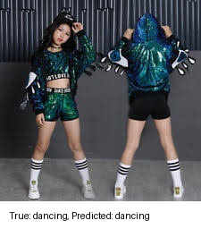

# Action Recognition and CNN Visualization

## Project Overview

This project implements a Convolutional Neural Network (CNN) for classifying human actions in images and extends its functionality to visualize filter maps and kernels on different layers of the CNN. The model is trained using the Human Action Recognition (HAR) Dataset from Kaggle, which contains 12,000 images across 15 different action classes.

In addition to training, this project includes tools to inspect and visualize the inner workings of the CNN, such as activations and convolutional kernels.

## Table of Contents

- [Project Overview](#project-overview)
- [Features](#features)
- [Requirements](#requirements)
- [Installation](#installation)
- [Usage](#usage)
  - [Training the CNN](#training-the-cnn)
  - [Predicting with the CNN](#predicting-with-the-cnn)
  - [Visualizing Activations](#visualizing-activations)
- [Model Architecture](#model-architecture)
- [Training](#training)
- [Evaluation](#evaluation)
- [Visualization](#visualization)
- [Results](#results)
  - [Training and Validation Performance](#training-and-validation-performance)
  - [Learning Curves](#learning-curves)
  - [Visualization and Predictions](#visualization-and-predictions)

## Features

- Custom CNN architecture based on ResNet-50
- Visualization of filter maps and kernels on different layers
- Support for 15 different action classes
- Utilizes PyTorch for model development
- GPU acceleration support (NVIDIA CUDA)
- Data augmentation and preprocessing
- Model training with validation
- Model evaluation with various metrics
- Extensive visualization capabilities for model interpretability
- Single example prediction and visualization

## Requirements

- Python 3.11.9
- NVIDIA GPU with CUDA support (tested on RTX 3050)
- PyTorch (used for model creation and training)
- Matplotlib (for visualizations)

  
## Installation

1. Clone the repository:
   ```bash
   git clone <repository-url>
   cd <repository-folder>
   ```
2. Set up the environment using the provided YAML file:
   ```bash
   conda env create -f md_env.yml
   conda activate <environment-name>
   ```

## Usage

### Training the CNN:

**main**

Use the `train.py` script to train the model:

```bash
python train.py
```
This script will:

- Load and preprocess the data
- Create the model
- Train the model
- Save the best model based on validation loss

### Predicting with the CNN:

Use the `predict5.py` script to make predictions on test images:

```bash
python predict5.py
```
This script will:

- Load the best trained model
- Evaluate it on the test set
- Display metrics such as accuracy, precision, recall, and F1-score
- Generate a confusion matrix

### Visualizing Activations:

To visualize the activations of different layers, use the `visualize_activations.py` script:
```bash
python visualize_activations.py
```
This script will create a grid visualization of activation maps for different layers.

For visualizing a single example, use:

```bash
python visualize_single_example.py
```

This script will:

- Load a random example from the dataset
- Pass it through the model
- Visualize activations of different layers
- Save the original image with true and predicted labels

## Model Architecture

The CNN architecture consists of a pre-trained ResNet-50 model with the final layers removed, and additional convolutional layers and dense layers added for classification. This architecture is tailored for human action recognition in images.

<p align="center">
  
</p>

1. Base Model:
   - Pre-trained ResNet-50 (weights frozen)
   - Removed the original fully connected layer
   - Output: 2048 channels, 7x7 spatial dimensions

2. Custom Layers:
   - Conv1: 2048 -> 512 channels, 3x3 kernel, padding 1
   - BatchNorm1
   - ReLU1
   - Conv2: 512 -> 256 channels, 3x3 kernel, padding 1
   - BatchNorm2
   - ReLU2
   - Adaptive Average Pooling: 256 channels to 1x1 spatial dimensions
   - Fully Connected: 256 -> num_classes

The architecture is designed to fine-tune the high-level features extracted by ResNet-50 for the specific task of action recognition.

## Training

The training process, implemented in `train.py`, begins with data preparation using a custom `ActionRecognitionDataset` class. This applies data augmentation techniques such as random resized cropping and horizontal flipping, followed by normalization. The data is split into training (80%) and validation (20%) sets.

For optimization, the model uses CrossEntropyLoss as the loss function and Adam as the optimizer with a learning rate of 0.001. The training loop iterates through 20 epochs (adjustable), performing forward passes, loss calculation, backpropagation, and parameter updates for each batch.

After each epoch, the model is evaluated on the validation set, and various metrics (loss, accuracy, precision, recall, F1-score) are computed and logged for both training and validation sets. The best model, based on validation loss, is saved during this process.

The training script also generates loss curves for both training and validation, providing a visual representation of the model's learning progress. While a fixed learning rate is currently used, implementing a learning rate schedule could potentially improve performance.

## Evaluation

The evaluation process, primarily implemented in `predict5.py`, provides a comprehensive assessment of the trained model's performance. It starts by loading the test dataset and the best saved model from training.

The script calculates several metrics to evaluate the model's performance: accuracy (percentage of correct predictions), precision (ability to avoid labeling negative samples as positive), recall (ability to find all positive samples), and F1-score (harmonic mean of precision and recall). These metrics are calculated as weighted averages across all classes to account for potential class imbalance.

In addition to these overall metrics, the script generates a confusion matrix, providing a detailed view of the model's performance across all classes. It also calculates precision, recall, and F1-score for each individual class, allowing for a nuanced understanding of where the model excels or struggles.

The evaluation process goes beyond mere numbers, incorporating various visualizations to provide insights into the model's decision-making process. These include displaying sample predictions with true and predicted labels, visualizing model activations for different layers, and creating a grid visualization of activation maps across multiple layers.

## Visualization

This project places a strong emphasis on visualization techniques to interpret and understand the model's behavior. The `visualize_activations.py` script creates a grid of images showing activations for each layer, using a color map to represent activation intensities and adding connections between layers to illustrate the network structure.

<p align="center" width="100%">
     
</p>

For a more focused analysis, `visualize_single_example.py` provides a detailed view of the model's processing of a single, randomly selected image. It displays the original image with true and predicted labels, shows activation maps for different layers, and visualizes the kernels (filters) of selected convolutional layers.

<p align="center">
  
</p>

Kernel visualization, implemented in the same script, extracts weights from specified convolutional layers (including both the base ResNet layer and custom layers), normalizes them, and plots them as images. This provides insights into the features learned by the model at different stages of processing.

<p align="center">
  
</p>

During training, loss curves are generated to help monitor model convergence and potential overfitting. The evaluation process produces a confusion matrix, offering a visual representation of the model's performance across all classes and helping identify commonly confused classes.

The `hooks.py` script implements functionality to save histograms of activation values for specified layers, which can be useful for detecting issues like vanishing or exploding gradients. For the final fully connected layer, a bar plot is generated showing the probability distribution across all classes for a single example, providing a clear view of the model's decision-making process.

These visualizations serve multiple purposes: they aid in model interpretation by revealing what features the model learns and how it makes decisions, help in debugging by identifying potential issues in the model architecture or training process, assist in performance analysis by visualizing the model's strengths and weaknesses, and facilitate communication by presenting the model's behavior in an intuitive, visual manner.

To generate all visualizations, first train the model using `train.py`, run the evaluation script `predict5.py`, execute `visualize_single_example.py` for single example visualization, and finally run `visualize_activations.py` for the activation map grid. All visualizations are saved in the `activations` directory for easy access and analysis.

## Results
Our Human Action Recognition model, based on a custom CNN architecture with a ResNet-50 backbone, has shown promising performance. Here's a detailed breakdown of the results:

### Training and Validation Performance
**Training:**
```bash
Overall Training Metrics:
Loss: 1.0510
Accuracy: 0.7210
Precision: 0.7200
Recall: 0.7210
F1-score: 0.7201   
```
**Validation:**
```bash
Overall Validation Metrics:
Loss: 1.2175
Accuracy: 0.6377
Precision: 0.6451
Recall: 0.6377
F1-score: 0.6369   
```
**Interpretation:**

1. Loss:

    - The training loss (1.0510) is lower than the validation loss (1.2175), which is expected. However, the gap between them suggests some overfitting. The relatively high loss values indicate that there's still room for improvement in the model's predictions.


2. Accuracy:

    - Training accuracy (72.10%) is higher than validation accuracy (63.77%), confirming the presence of overfitting. The validation accuracy of 63.77% means the model correctly classifies about 2 out of 3 samples in the validation set, which is decent but leaves room for improvement.


3. Precision:

    - Training precision (72.00%) is higher than validation precision (63.51%). The validation precision indicates that when the model predicts a certain class, it's correct about 63.51% of the time.


4. Recall:

    - Training recall (72.10%) is higher than validation recall (63.77%). The validation recall suggests that the model correctly identifies 63.77% of the actual positive samples for each class.


5. F1-score:

    - The F1-scores for both training (72.01%) and validation (63.39%) are very close to their respective accuracy scores, indicating a good balance between precision and recall. The validation F1-score of 63.39% represents a harmonious mean of precision and recall, providing a single metric that balances both false positives and false negatives.


**Overall Analysis:**

The model shows good performance on the training set, with all metrics around 72%, indicating effective learning from the training data.
However, the drop in performance on the validation set (all metrics around 63-64%) suggests overfitting. The model has learned the training data well but struggles to generalize to unseen data.
The consistent values across accuracy, precision, recall, and F1-score for both training and validation suggest that the model's performance is relatively balanced across different classes.
The gap between training and validation metrics (about 8-9 percentage points) indicates that there's potential for improvement in the model's generalization ability.

### Learning curves
The learning curves show the model's training and validation loss over the course of 20 epochs:

<p align="center">
  
</p>

**Key observations:**

1. The training loss consistently decreases over time, indicating that the model is learning the training data well.
2. The validation loss initially decreases but then plateaus and slightly increases, suggesting some overfitting after around epoch 5.
3. There's a noticeable gap between training and validation loss, further indicating overfitting to the training data.


### Visualization and predictions

**Prediction**
The image demonstrates the model's ability to recognize different human actions with varying degrees of confidence.

<p align="center">
  
</p>

These results highlight the model's strengths in recognizing certain actions like eating and texting with high confidence. However, the lower probabilities for dancing and drinking suggest areas where the model might need improvement, possibly due to variations in how these actions are performed or presented in the training data. This visualization provides valuable insights into the model's decision-making process and areas for potential refinement in future iterations.

**Network feature maps and kernels visiualization**

The visualization of activation maps and kernels across different layers of the network provides valuable insights into how our model processes and interprets input images for human action recognition.

<p align="center">
  
</p>

Starting with an input image (3x224x224) of a person holding a drink, we can trace the flow of information through the network. The initial ResNet layers process this input, with Resn.Conv2d (64,64,3,3,1,1) applying the first set of convolutional filters. As we progress through the ResNet backbone, we observe increasingly abstract representations in the activation maps.

The "end of ResNet" marker signifies the transition from the pretrained ResNet features to our custom head. This custom head begins with a Conv2d layer (2048,512,3,3,1,1), followed by another Conv2d layer (512,256,3,3,1,1), each refining and condensing the feature representations.

- The activation maps for each layer provide insight into what the model "sees" at different stages:

    - Early ResNet layers (kernels_conv2, resnet_conv2, resnet_relu2) show more general, low-level features like edges and textures.
    - The custom head layers (layer_conv1, layer_relu1, kernels_conv2, layer_conv2, layer_relu2) demonstrate more specific, high-level features that are likely action-relevant.
    
Particularly noteworthy is the progression of feature abstraction. The resnet_relu2 layer shows complex, distributed activations, while the final layer_relu2 exhibits more focused, localized activations. This suggests that the model has learned to attend to specific regions or features that are most indicative of the action being performed.

The final part of the visualization shows the probability distribution across different action classes. In this case, the model strongly predicts the "drinking" action, which aligns with the content of the input image. This high confidence (around 0.8 probability) for the correct class demonstrates the model's ability to effectively utilize the learned features for accurate classification.
